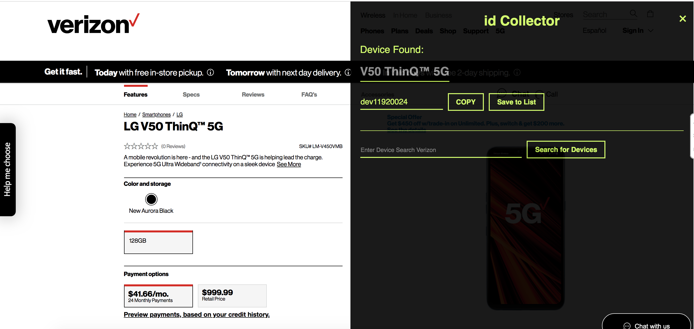
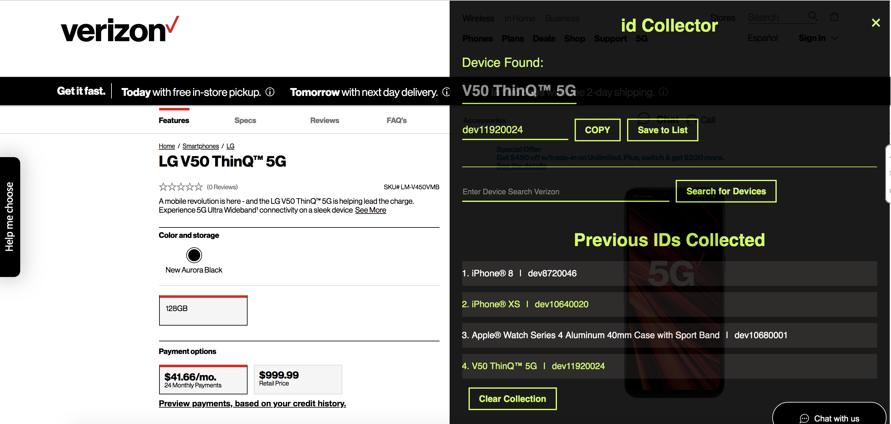
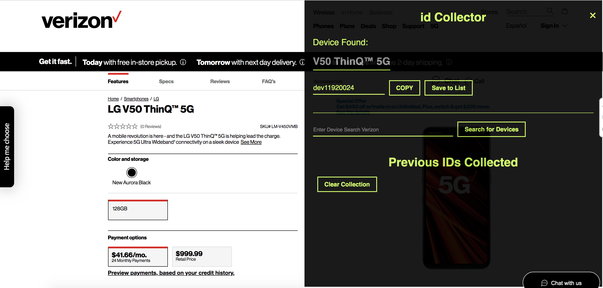
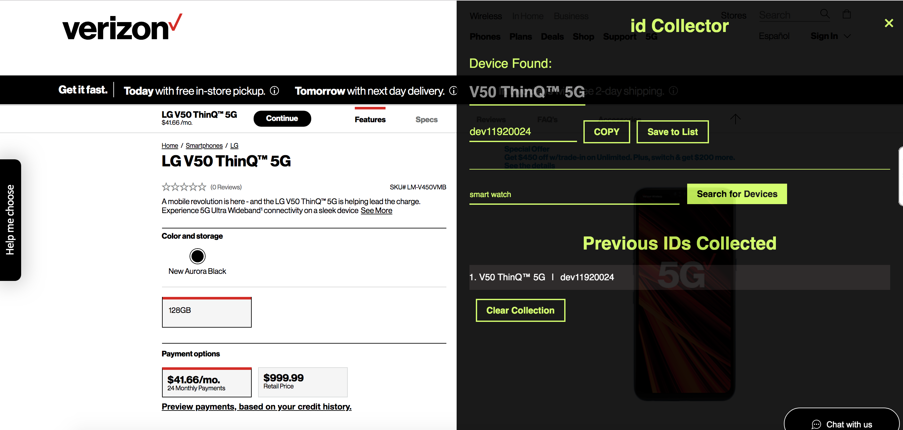
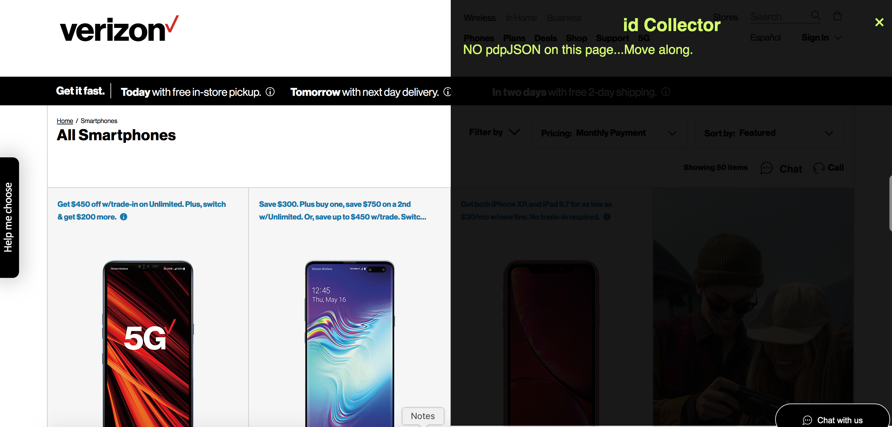

# idFinder 

Often times, our team needs the deviceID from products. These device ids can be found on a global object called PDPJSON on product pages. Digging up these ids is time consuming so I spend some effort creating a small bookmarket to easily extract this information.

## How it works

Leverage code as a bookmarklet. Go to product page and launch bookmarklet.

The device name and id are referenced. You make copy the device id to your clipboard by selecting the copy button.

### Save to List

The "Save to List" button takes the current device information (name and device id), populates an array and saves it to local storage.

As you can see from the list, there is device information that was previously saved. 

### Clearing the list

The "Clear Collection" button will clear the list of information, ensuring local storage is also cleared to ensure the previously saved items are removed.

### Search

The search input will search for search terms

### No device id found

In the event no device id is present, message will be presented and users can remove panel using the close button in right hand corner.

