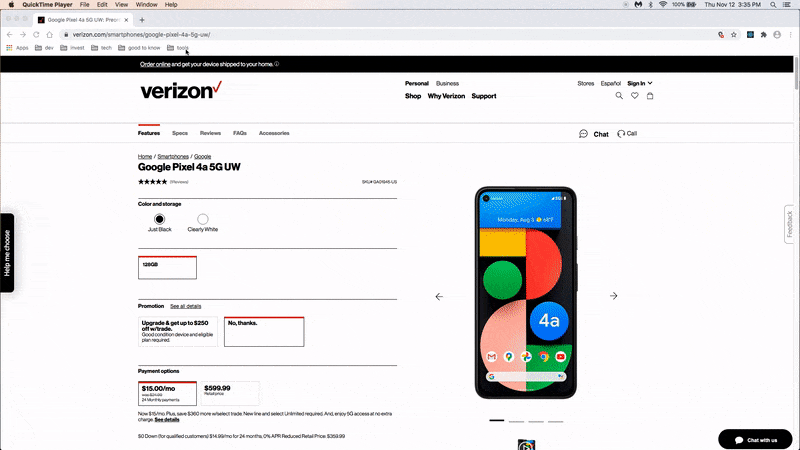

# idFinder

I was taking a course on JavaScript Design Patterns [Udacity](https://www.udacity.com/course/javascript-design-patterns--ud989). One of the sections covered Separation of Concerns which was focused on the principals of model, view, controller. I wanted to apply this principal as illustrated in the course material using Vanilla JavaScript to a project.

At the time, there was a need for business users to obtain product ids from Verizon product pages. To aid them, I decided to create a bookmarklet to speed this time consuming task.

## idFinder in action

### Features of idFinder
* Bookmarklet that works with Google Chrome browsers.
* When idFinder is activated on Verizon product pages, a partial modal is opened that displays product id and product name
* Product id can be copied to desktop clipboard
* Product information can be saved to list (stored in local storage)
* Product lists can be cleared (will clear stored local storage info)
* Search functionality allows user to search for additional products